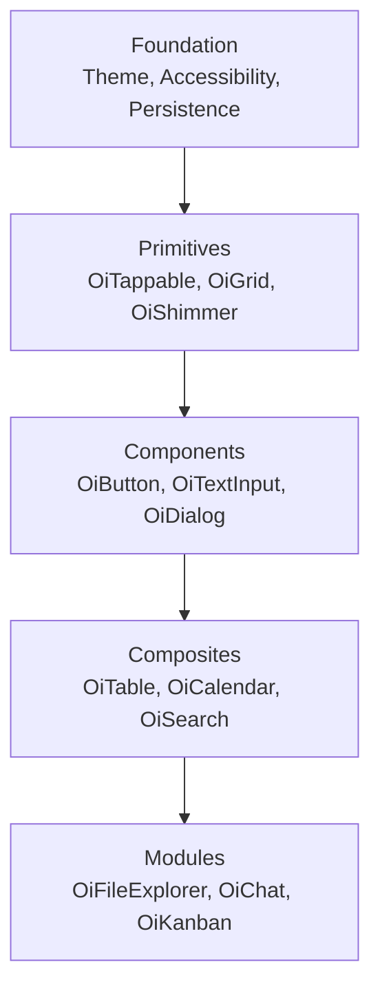

# Component Tiers

ObersUI organizes its 100+ widgets into four tiers. Each tier builds on the one below — like layers of a well-structured dessert.

## Foundation

The base layer. Not visible widgets, but the services everything depends on.

- **Theme** — Design tokens (colors, spacing, typography, radius, shadows, animations)
- **Accessibility** — Reduced motion detection, touch target enforcement, screen reader support
- **Persistence** — Settings drivers that auto-save user preferences
- **Platform** — Input modality detection, safe areas, platform adaptation

You interact with the foundation through `OiApp` and `context` extensions. See [Theming](theming.md) for details.

## Tier 1: Primitives

Single-purpose, low-level widgets. They render one thing and do it well.

**Examples:**

| Widget | Purpose |
| --- | --- |
| `OiTappable` | Tap handler with hover, focus, and press feedback |
| `OiGrid` | Responsive CSS Grid-like layout |
| `OiShimmer` | Loading shimmer animation |
| `OiDraggable` | Makes any widget draggable |
| `OiVirtualList` | Virtualized scrollable list |
| `OiTouchTarget` | Enforces 48x48dp minimum touch area |
| `OiSliverList` | Themed sliver list wrapper |
| `OiSliverGrid` | Themed sliver grid wrapper |

Primitives are the Lego bricks. Most users won't use them directly — components are built from them.

## Tier 2: Components

Standard UI components that you'll use every day. Built from primitives, styled by the theme.

**Examples:**

| Widget | Purpose |
| --- | --- |
| `OiButton` | Primary, secondary, outline, ghost, destructive variants |
| `OiTextInput` | Text field with validation and formatting |
| `OiSelect` | Dropdown select with search |
| `OiDialog` | Modal dialog with configurable actions |
| `OiToast` | Toast notification system |
| `OiTabs` | Tab navigation with persistence |
| `OiCard` | Content container with shadow |
| `OiAvatar` | User avatar with image or initials |
| `OiNavigationRail` | Compact vertical navigation rail |
| `OiSliverHeader` | Sticky sliver header with collapsing variants |
| `OiDialogShell` | Low-level dialog container |
| `OiSnackBar` | Brief action feedback bar |
| `OiRefreshIndicator` | Pull-to-refresh wrapper |
| `OiPageIndicator` | Dot indicators for paged content |
| `OiScrollToTop` | Floating scroll-to-top button |
| `OiBackButton` | RTL-aware back navigation button |
| `OiFormSelect` | Form-integrated dropdown with validation |
| `OiSwitchTile` | Toggle tile with switch, label, and subtitle |
| `OiCheckboxTile` | Toggle tile with checkbox, label, and subtitle |
| `OiRadioTile` | Toggle tile with radio indicator |
| `OiSegmentedControl` | Exclusive segment toggle (2-5 options) |
| `OiDatePickerField` | Date input with calendar dialog |
| `OiDateRangePickerField` | Date range input with presets |
| `OiTimePickerField` | Time input with time picker dialog |
| `OiTabView` | Tab bar with content switching and lazy loading |

This is the tier most developers will interact with the most.

## Tier 3: Composites

Multi-component patterns that solve complex UI problems. Built from components.

**Examples:**

| Widget | Purpose |
| --- | --- |
| `OiTable` | Full data table with sort, filter, resize, pagination, inline edit |
| `OiForm` | Form container with validation |
| `OiCalendar` | Day/week/month calendar view |
| `OiSearch` | Full-text search with filters |
| `OiCommandBar` | Ctrl+K command palette |
| `OiHeatmap` | 2D data heat grid |
| `OiGantt` | Gantt chart timeline |
| `OiTour` | Multi-step guided onboarding |
| `OiResponsiveShell` | Responsive navigation shell |
| `OiReorderableList` | Drag-to-reorder list with keyboard support |
| `OiDataGrid` | Lightweight data grid with sorting and selection |
| `OiFormDialog` | Form dialog with managed lifecycle |

## Tier 4: Modules

Complete, feature-rich screens you can drop into your app. Built from composites.

**Examples:**

| Widget | Purpose |
| --- | --- |
| `OiFileExplorer` | Full file browser with sidebar, toolbar, grid/list views |
| `OiChat` | Messaging interface with threads, reactions, attachments |
| `OiDashboard` | Draggable, resizable widget grid |
| `OiKanban` | Kanban board with drag-and-drop |
| `OiComments` | Threaded discussion system |
| `OiNotificationCenter` | Notification panel |

Modules are the richest layer — they can have 60+ parameters and handle complex interactions out of the box.

## The rule

> **Each tier only imports from the tier below it.**

Primitives don't know about components. Components don't know about composites. This keeps the dependency graph clean and makes each layer independently testable.

## Which tier should I use?

- **Building a screen?** Start with **modules** — they handle the heavy lifting
- **Building a form?** Use **composites** like `OiForm` and `OiTable`
- **Building custom UI?** Compose from **components**
- **Building a design system on top of ObersUI?** Work with **primitives**
