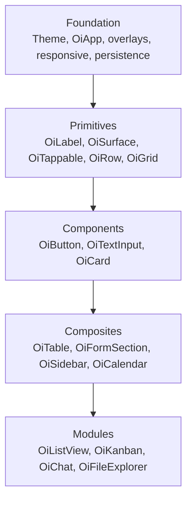

# The Four Tiers

ObersUI sorts its widgets into layers. Each layer builds on the one below it. This
page explains what lives in each layer, shows a few widgets from each, and tells
you when to build at that level. Two simple rules keep the whole library
predictable, and they are at the bottom of this page.

There is a base layer plus four widget tiers. The base layer, Foundation, holds
the services every widget relies on. Above it sit Primitives, Components,
Composites, and Modules. The higher you go, the more a single widget does for you.


```mermaid
graph TD
    F[Foundation<br/>Theme, OiApp, overlays, responsive, persistence] --> P[Primitives<br/>OiLabel, OiSurface, OiTappable, OiRow, OiGrid]
    P --> C[Components<br/>OiButton, OiTextInput, OiCard]
    C --> X[Composites<br/>OiTable, OiFormSection, OiSidebar, OiCalendar]
    X --> M[Modules<br/>OiListView, OiKanban, OiChat, OiFileExplorer]
```

## At a glance

| Tier | What it is | Reach for it when |
| --- | --- | --- |
| Foundation | Theme and app services, no visible widgets | You configure the app or read a theme token. |
| Primitives | Single-purpose building blocks | You build a widget of your own. |
| Components | Everyday UI elements | You lay out a custom screen. |
| Composites | Multi-component patterns | You need a table, a form, or a calendar. |
| Modules | Full-feature screens | You want a whole screen ready to drop in. |

## Foundation

The base layer. These are services, not widgets you place on screen. Everything
above depends on them. `OiApp` sets them up, and you read them through `context`
extensions.

What lives here:

- **Theme.** Design tokens for colors, spacing, typography, radius, shadows, and
  animation.
- **Overlays.** The host that dialogs, toasts, and menus render into.
- **Responsive.** Breakpoints and the current screen size.
- **Persistence.** Drivers that save user settings like theme mode.
- **Accessibility.** Reduced-motion detection and touch-target enforcement.

You wrap your app in `OiApp` once at the root.

```dart
OiApp(
  theme: OiThemeData.light(),
  darkTheme: OiThemeData.dark(),
  home: const HomeScreen(),
)
```

Inside the app, you read tokens from `context`.

```dart
OiSurface(
  color: context.colors.surface,
  padding: EdgeInsets.all(context.spacing.md),
  child: OiLabel.body('Reads its color and padding from the theme'),
)
```

Build at this level only to configure the app or to read a token. See
[Theming](theming.md) for the full token set.

## Primitives

Single-purpose widgets. Each renders one thing. Components are built from these,
so you often use them without noticing. Reach for a primitive when you build a
widget of your own and no component fits.

A few you will meet:

| Widget | What it does |
| --- | --- |
| `OiLabel` | All text display. Use it instead of `Text`. |
| `OiSurface` | A themed box with background, border, and radius. |
| `OiTappable` | A tap target with hover, focus, and press states. |
| `OiRow` | A horizontal layout with a themed gap and collapse. |
| `OiColumn` | The vertical version of `OiRow`. |
| `OiGrid` | A responsive grid that reflows by breakpoint. |
| `OiTouchTarget` | Enforces a minimum 48 by 48 tap area. |

Text and layout always go through these. Use `OiLabel` in place of `Text`, and
`OiRow`, `OiColumn`, or `OiGrid` in place of `Row`, `Column`, or `GridView`.

```dart
OiColumn(
  gap: OiResponsive<double>(context.spacing.md),
  children: [
    OiLabel.h3('Profile'),
    OiRow(
      gap: OiResponsive<double>(context.spacing.sm),
      children: [
        OiLabel.body('Name'),
        OiLabel.bodyStrong('Ada Lovelace'),
      ],
    ),
  ],
)
```

Build at this level when you write a reusable widget for your own design system.
Most app code does not touch primitives directly.

## Components

The everyday UI elements. You will use this tier the most. Each component is built
from primitives and styled by the theme, so they all match without extra work.

Common ones:

| Widget | What it does |
| --- | --- |
| `OiButton` | The everyday button, with six variants. |
| `OiTextInput` | A text field with validation and formatting. |
| `OiSelect` | A dropdown with optional search. |
| `OiCard` | A content container with a border and shadow. |
| `OiDialog` | A modal dialog with configurable actions. |
| `OiToast` | A brief notification. |
| `OiTabs` | Tab navigation. |
| `OiAvatar` | A user avatar from an image or initials. |

Here is a small card built from components and layout primitives.

```dart
OiCard(
  child: OiColumn(
    gap: OiResponsive<double>(context.spacing.md),
    children: [
      OiLabel.h3('Invite a teammate'),
      OiLabel.body('They will get access to this workspace.'),
      OiButton.primary(
        label: 'Send invite',
        onTap: () => sendInvite(),
      ),
    ],
  ),
)
```

Build at this level when you assemble a custom screen and no composite or module
covers the whole pattern. See [Buttons and Actions](../widgets/buttons.md) for one
component group in full.

## Composites

Multi-component patterns that solve a larger problem in one widget. A composite
wires several components together and manages their shared state. Reach for one
when you need a table, a form, a calendar, or a side navigation.

A few examples:

| Widget | What it does |
| --- | --- |
| `OiTable` | A data table with sort, filter, resize, pagination, and inline edit. |
| `OiFormSection` | A group of form fields with a heading and validation. |
| `OiFormDialog` | A form inside a dialog with a managed submit lifecycle. |
| `OiSidebar` | A collapsible side navigation. |
| `OiCalendar` | A day, week, or month calendar view. |
| `OiDataGrid` | A lighter grid with sorting and selection. |
| `OiReorderableList` | A drag-to-reorder list with keyboard support. |

A form section groups fields and shows one heading over them.

```dart
OiFormSection(
  title: 'Account',
  children: [
    OiTextInput(label: 'Email', onChanged: (v) => email = v),
    OiTextInput(label: 'Display name', onChanged: (v) => name = v),
  ],
)
```

Build at this level when a full data table or form is the job. You do not
reassemble one from components each time.

## Modules

Complete screens you drop into your app. A module handles a whole feature, from
layout to interaction to empty states. It is the highest tier, and a single module
can take many parameters.

Some of what ships here:

| Widget | What it does |
| --- | --- |
| `OiListView` | A full list screen with search, filters, and selection. |
| `OiKanban` | A board with drag-and-drop columns and cards. |
| `OiChat` | A messaging view with threads, reactions, and attachments. |
| `OiFileExplorer` | A file browser with sidebar, toolbar, and grid or list views. |
| `OiDashboard` | A draggable, resizable widget grid. |
| `OiComments` | A threaded discussion view. |
| `OiNotificationCenter` | A notification panel. |

You give a module its data and its callbacks, and it renders the rest.

```dart
OiKanban(
  label: 'Task board',
  columns: boardColumns,
  onCardMove: (item, fromColumn, toColumn, newIndex) =>
      moveCard(item, toColumn, newIndex),
)
```

Build at this level when a whole screen matches a module. It saves the most work.

## The two rules

Keep these two rules in mind and the library stays predictable.

**Each tier only imports from the tier below.** Primitives do not know about
components. Components do not know about composites. Composites do not know about
modules. This keeps the dependency graph clean and lets each layer be tested on
its own.

**Reach for the highest tier that fits, then drop down.** Start at Modules. If no
module matches, try a Composite. If that does not fit, build from Components. Drop
to Primitives only when you write a reusable widget of your own. Working top-down
means you write less code and inherit more behavior.

!!! tip
    A common mistake is rebuilding a table or a form from components by hand.
    Check the Composites tier first. `OiTable` and `OiFormSection` already handle
    sorting, validation, and layout for you.

## Related

- [Theming](theming.md) for the Foundation tokens and how to brand them.
- [Buttons and Actions](../widgets/buttons.md) for a Components group in detail.
